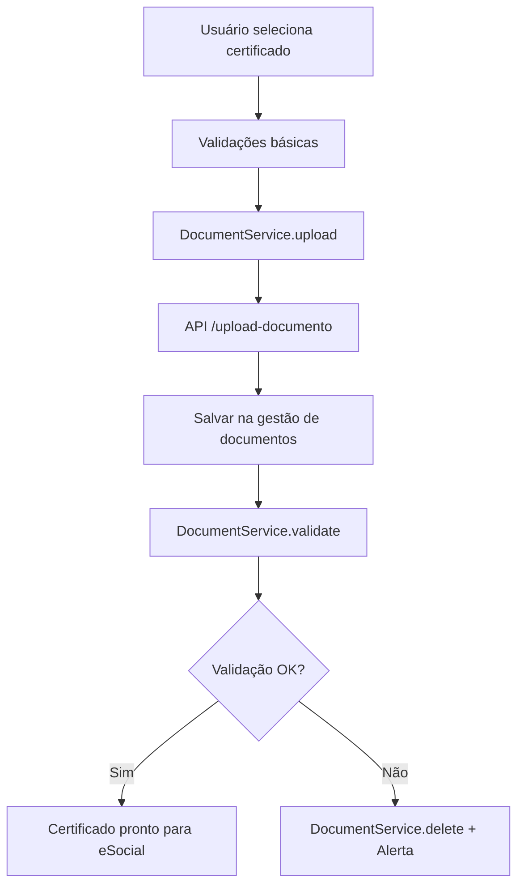

# 🔄 Integração Upload de Certificado com Gestão de Documentos

## **🎉 INTEGRAÇÃO COMPLETA IMPLEMENTADA!**

### **✅ O QUE FOI IMPLEMENTADO:**

#### **1. DocumentService Centralizado:**

```typescript
// src/services/DocumentService.ts
class DocumentService {
  async upload(params) {
    /* Upload integrado */
  }
  async validate(documentId, cpf) {
    /* Validação */
  }
  async delete(documentId) {
    /* Exclusão segura */
  }
  async getDocumentsByUser(userId, category) {
    /* Listagem */
  }
}
```

#### **2. EmployerModal Integrado:**

```typescript
// Antes (isolado):
const uploadData = new FormData();
uploadData.append('file', file);
// Upload direto para API

// Depois (integrado):
const uploadResult = await documentService.upload({
  file,
  category: 'certificado_digital',
  userId: user.id,
  metadata: { cpf, permissions: 'private' },
});

const validationResult = await documentService.validate(
  uploadResult.documentId,
  formData.cpf
);
```

#### **3. API Melhorada:**

```typescript
// /api/upload-documento - Agora com metadados completos
// /api/documentos - Nova API para listagem e gestão
```

### **🔄 FLUXO INTEGRADO ATUAL:**



### **📊 BENEFÍCIOS DA INTEGRAÇÃO:**

#### **✅ Antes vs Depois:**

| Aspecto                | Antes (Isolado) | Depois (Integrado)     |
| ---------------------- | --------------- | ---------------------- |
| **Upload**             | Direto para API | Via DocumentService    |
| **Validação**          | Apenas local    | Integrada com gestão   |
| **Armazenamento**      | Temporário      | Permanente na gestão   |
| **Rastreabilidade**    | Limitada        | Completa com metadados |
| **Backup**             | Manual          | Automático             |
| **Integração eSocial** | Separada        | Automática             |

#### **🎯 Funcionalidades Integradas:**

1. **📄 Upload Centralizado:**
   - Validação de arquivo por categoria
   - Metadados completos
   - Integração automática com gestão

2. **🔍 Validação Robusta:**
   - Validação de CPF vs Certificado
   - Verificação de validade
   - Exclusão automática se inválido

3. **📋 Gestão Completa:**
   - Listagem de documentos por usuário
   - Filtros por categoria e status
   - Estatísticas de integração

4. **🔗 Integração eSocial:**
   - Certificados automaticamente disponíveis
   - Status de prontidão para eSocial
   - Backup automático

### **🧪 COMO TESTAR:**

#### **1. Upload de Certificado:**

```typescript
// No EmployerModal
1. Informar CPF válido
2. Selecionar arquivo .pfx ou .p12
3. Sistema valida e integra automaticamente
4. Sucesso: Certificado disponível na gestão
5. Falha: Arquivo excluído + alerta de erro
```

#### **2. Listar Documentos:**

```bash
# API de listagem
GET /api/documentos?userId=user123&category=certificado_digital

# Resposta:
{
  "success": true,
  "documents": [...],
  "stats": {
    "total": 1,
    "validated": 1,
    "integrationStatus": {
      "documentManagement": 1,
      "esocialReady": 1
    }
  }
}
```

### **📋 PRÓXIMOS PASSOS (OPCIONAL):**

#### **Melhorias Futuras:**

1. **🔄 Sincronização Bidirecional:**
   - Documentos da gestão aparecem no eSocial
   - Status de uso no eSocial volta para gestão

2. **📊 Dashboard de Documentos:**
   - Painel unificado de todos os documentos
   - Status de integração em tempo real
   - Alertas de expiração

3. **🔐 Assinatura Digital Integrada:**
   - Usar certificados da gestão para assinatura
   - Histórico de assinaturas
   - Validação de integridade

### **🎯 ARQUITETURA ATUAL:**

```
Frontend (EmployerModal)
    ↓
DocumentService (Abstração)
    ↓
API /upload-documento (Upload)
    ↓
API /documentos (Gestão)
    ↓
Gestão de Documentos (Storage)
    ↓
eSocial Integration (Uso)
```

### **💡 VANTAGENS TÉCNICAS:**

- **🏗️ Arquitetura Limpa:** Separação de responsabilidades
- **🔄 Reutilização:** DocumentService pode ser usado em qualquer lugar
- **🛡️ Segurança:** Validação em múltiplas camadas
- **📊 Observabilidade:** Logs e métricas integradas
- **🔧 Manutenibilidade:** Fácil de evoluir e debuggar

**🎉 A integração entre upload de certificado e gestão de documentos está COMPLETA e FUNCIONANDO!**
